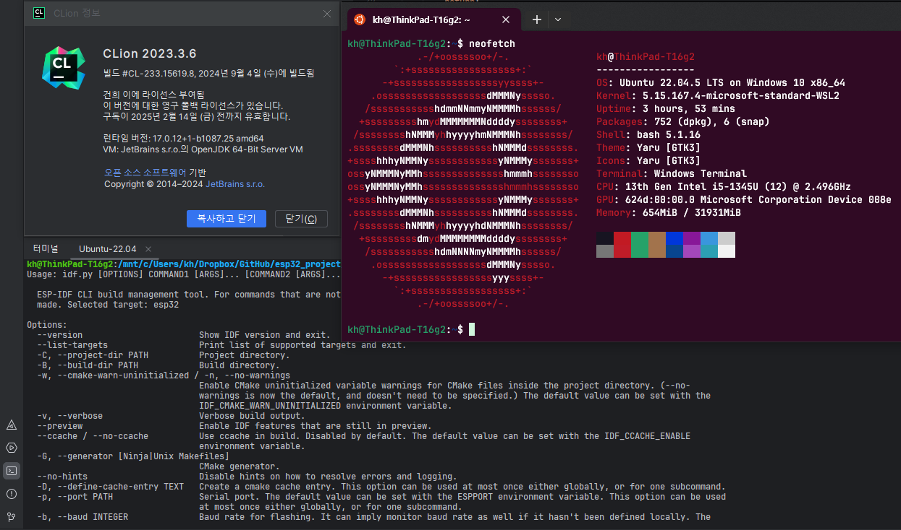

# esp32_project
esp32 개발 기록

## 개발환경
- CLion @ Windows 10
- 각종 빌드 도구 @ Ubuntu 22 LTS (WSL)

WSL상에서 모든 개발이 진행되고, 코드 편집만 윈도우 상에서 실행되는 CLion으로 함을 목적으로 함

## 목차
### 1. pj01_hello_world
예제로 이미 있는 Hello, world 작동

### 2. pj02_wifi_webserver
wifi로 연결되는 간단한 웹서버 구현

##
**[ESPRESSIF SYSTEM](https://www.espressif.com/) HAVE ALL RIGHT OF EXAMPLE CODES, LIBRARY, etc.**